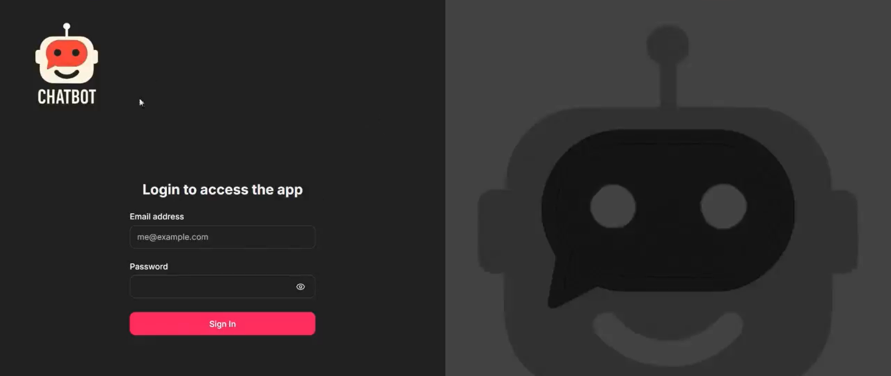
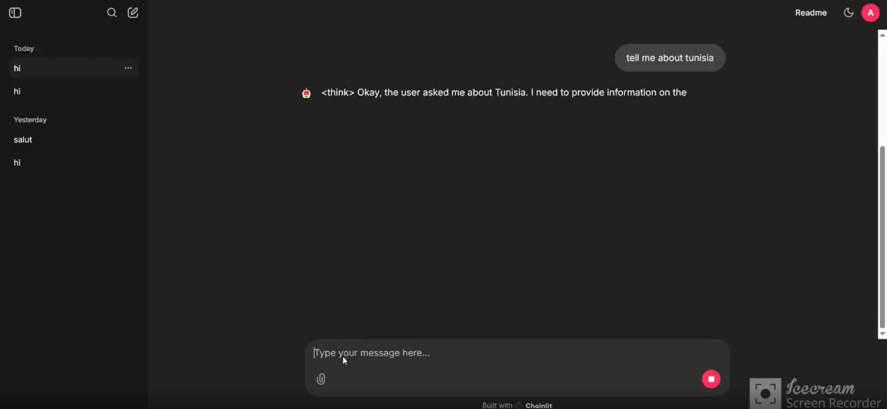

# chatgpt_clone


## About
🚀 Excited to share a recent project where I built an interactive AI chatbot using **Chainlit** and **Ollama** 🦙 !
This chatbot integrates a **PostgreSQL database** for persistent data storage and a **Qwen3 model** for real-time, streaming responses. With a strong focus on seamless user **authentication** and **chat history** management, the project demonstrates how to deploy a **locally hosted AI chatbot** with a simple and scalable architecture. 
## Interface




## Demo


https://youtu.be/IwEgKAm4lm0?si=_SeZ7KmLxzCPob9e
## Prerequisites
## Installation & Setup

[Install Python] https://www.python.org/downloads/

[Install pip]

```
curl https://bootstrap.pypa.io/get-pip.py -o get-pip.py
```

```
python3 get-pip.py
```

Ensure pip is installed by running the following command

```
pip --version
```

If you have Python & pip installed then check their version in the terminal or command line tools

```
python3 --version
```

```
pip --version
```

## Installing requirements

In your terminal run the requirements.txt file using this pip

```
pip install -r requirements.txt
```
